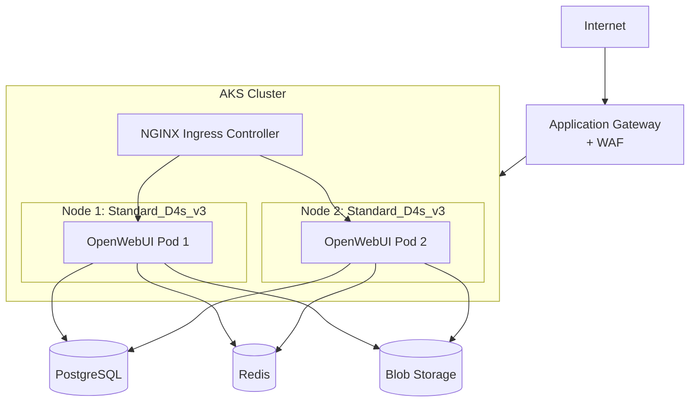
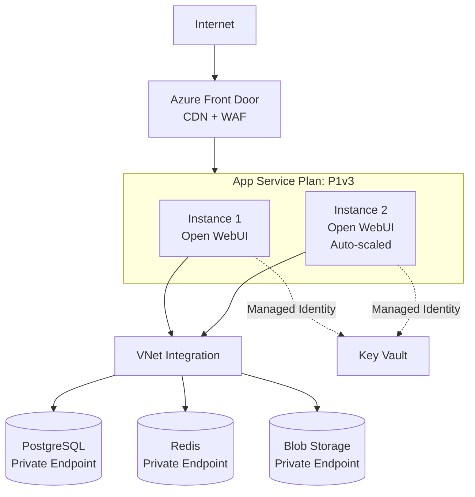
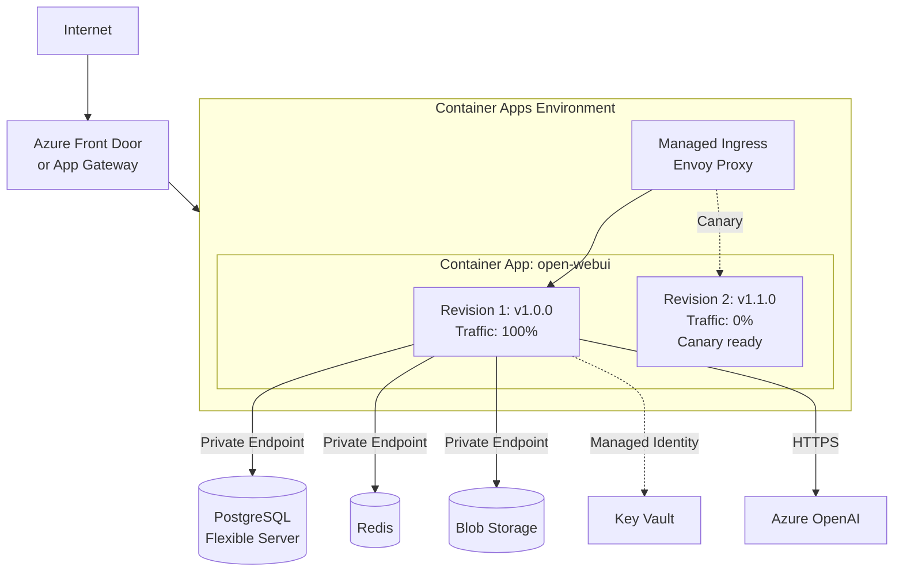
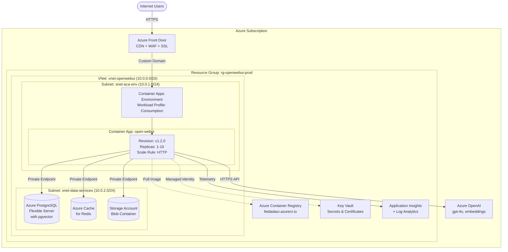
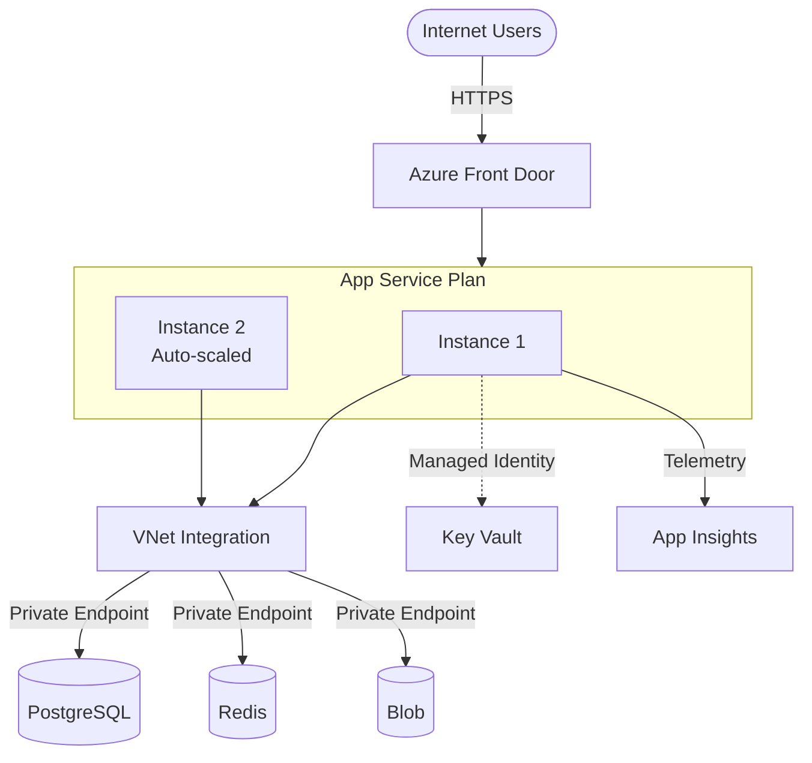

# Azure 部署評估報告 (Azure Hosting Assessment)

針對 **Open WebUI** 類型的 AI/LLM Web 應用程式，以下詳細比較四種 Azure 主要容器部署方案：
- Azure Kubernetes Service (AKS)
- Azure Web App for Containers (App Service)
- Azure Container Instances (ACI)
- Azure Container Apps (ACA)

---

## 1. 方案比較總覽 (Comparison Matrix)

| 特性 (Feature)           | **Azure Kubernetes Service (AKS)**                                              | **Web App for Containers**                          | **Azure Container Instances (ACI)**       | **Azure Container Apps (ACA)** ⭐                                                    |
| :----------------------- | :------------------------------------------------------------------------------ | :-------------------------------------------------- | :---------------------------------------- | :----------------------------------------------------------------------------------- |
| **適用場景**             | • 大規模微服務架構<br>• 需完整 K8s API<br>• 既有 K8s 團隊<br>• 複雜調度需求     | • 單體 Web 應用<br>• 傳統架構<br>• 最簡易部署       | • 臨時任務/批次作業<br>• 測試環境<br>• Serverless jobs | • **現代微服務**<br>• **Serverless 容器**<br>• 需彈性擴展                            |
| **架構複雜度**           | 🔴 **高 (High)**<br>需維護 Cluster, Ingress, Node Pools                         | 🟢 **低 (Low)**<br>PaaS 體驗，類傳統 Hosting         | 🟢 **低 (Low)**<br>單純容器執行            | 🟡 **中 (Medium)**<br>K8s 封裝，無需管理底層                                         |
| **維運成本 (Ops)**       | 🔴 **高**<br>需 K8s 專業知識、定期升級                                           | 🟢 **低**<br>Azure 全託管                           | 🟢 **低**<br>無 Server 管理                | 🟡 **中-低**<br>Azure 託管底層 K8s                                                   |
| **費用模型 (Pricing)**   | **固定成本高**<br>• VM nodes (持續計費)<br>• Cluster 管理費<br>• Load Balancer 費 | **可預測**<br>• App Service Plan (固定費用)<br>• 依 SKU 計費 | **彈性但長期貴**<br>• 按秒計費 (vCPU + Memory)<br>• 長期執行不划算 | **最彈性** 🏆<br>• Consumption Plan (按使用量)<br>• Scale to Zero<br>• 或 Dedicated Plan |
| **Autoscale**            | ⭐⭐⭐⭐⭐<br>HPA, VPA, Cluster Autoscaler                                         | ⭐⭐⭐<br>基本 (CPU/Memory/Schedule)                  | ⭐<br>基本無 (需外掛 logic)                 | ⭐⭐⭐⭐⭐<br>**KEDA** (HTTP, Queue, Events)                                            |
| **Scale to Zero**        | ❌                                                                               | ❌                                                   | ✅ (天生支援)                              | ✅ (Consumption Plan)                                                                |
| **冷啟動時間**           | 極快 (pod 預熱)                                                                  | 快 (Always On)                                      | 慢 (10-60 秒)                             | 中 (5-15 秒, 可預熱)                                                                 |
| **VNet 整合**            | ⭐⭐⭐⭐⭐<br>完整 (CNI, Network Policy, Private Cluster)                         | ⭐⭐⭐⭐<br>VNet Integration + Private Endpoint        | ⭐⭐<br>支援但昂貴/複雜                     | ⭐⭐⭐⭐<br>Environment-level VNet                                                     |
| **負載平衡**             | 完整 (Ingress, Service Mesh)                                                     | 內建 (ARR)                                          | 無 (需外接)                                | 內建 (Envoy)                                                                         |
| **健康檢查**             | ✅ (Liveness, Readiness, Startup)                                                | ✅ (基本)                                            | ✅ (基本)                                  | ✅ (完整)                                                                            |
| **藍綠/金絲雀部署**       | ✅ (手動或 Argo/Flux)                                                            | ✅ (Deployment Slots)                                | ❌                                         | ✅ (Revisions + Traffic Split)                                                       |
| **Managed Identity**     | ✅ (Pod Identity, Workload Identity)                                             | ✅ (System/User Assigned)                            | ✅                                         | ✅ (System/User Assigned)                                                            |
| **監控整合**             | ⭐⭐⭐⭐⭐<br>Container Insights, Prometheus                                       | ⭐⭐⭐⭐<br>App Service 內建監控                       | ⭐⭐⭐<br>基本 Log Analytics                | ⭐⭐⭐⭐⭐<br>完整 Log Analytics + App Insights                                        |
| **適合 Open WebUI?**     | ⚠️ **過度設計**<br>除非有其他微服務                                              | ✅ **非常適合**<br>單體架構最佳選擇                   | ❌ **不建議**<br>缺生產級功能               | ✅ **最推薦** 🏆<br>現代化、彈性、成本效益                                            |

---

## 2. 詳細評估 (Detailed Assessment)

### 2.1 Azure Kubernetes Service (AKS) 🔷

#### 優點 (Pros)
- ✅ **最完整的容器編排功能**: 完整 K8s API, Helm, Operators, Service Mesh (Istio/Linkerd)
- ✅ **企業級監控**: Container Insights, Prometheus, Grafana 整合
- ✅ **多微服務支援**: 若未來要部署 Ollama, Vector DB, Worker Nodes 等獨立服務，AKS 是最佳選擇
- ✅ **靈活調度**: Pod affinity, node selectors, taints/tolerations
- ✅ **GPU 支援**: 可部署 GPU nodes 用於本地 LLM 推理
- ✅ **生態系豐富**: 大量第三方工具與整合

#### 缺點 (Cons)
- ❌ **複雜度高**: 需要專業 K8s 管理能力
- ❌ **成本較高**: 至少需要 2-3 個 worker nodes (VM 費用持續) + Cluster 管理費 (若選 SLA)
- ❌ **維運負擔**: 需定期升級 K8s 版本、監控 node health、管理 storage classes
- ❌ **對於單一應用過度設計**: Open WebUI 是一個 monolithic app，不需要 K8s 的複雜性
- ❌ **冷啟動慢**: 新增 node 需時 5-10 分鐘

#### 適用情境
- ✅ 已有 K8s 維運團隊
- ✅ 計畫部署多個微服務 (例如：Open WebUI + Ollama + Vector DB + Embedding Service)
- ✅ 需要 GPU 支援（本地 LLM 推理）
- ✅ 預期長期高流量 (Cost-per-hour 較低)

#### 架構示意圖



#### 成本估算 (每月，東亞區域)

| 項目                     | 規格                          | 數量 | 月費 (USD) |
| :----------------------- | :---------------------------- | :--- | :--------- |
| AKS Control Plane        | Standard (SLA 99.95%)         | 1    | $73        |
| Worker Nodes             | Standard_D4s_v3 (4 vCPU/16GB) | 2    | $280       |
| Load Balancer (Standard) | -                             | 1    | $22        |
| Managed Disks            | Premium SSD 128GB             | 2    | $40        |
| **總計**                 |                               |      | **$415**   |

> 不含 PostgreSQL, Redis, Storage 等資料層服務費用

---

### 2.2 Azure Web App for Containers 🌐

#### 優點 (Pros)
- ✅ **最簡單的部署方式**: Deployment Center 整合 GitHub/ACR，一鍵部署
- ✅ **內建功能豐富**: 
  - Easy Auth (Entra ID, Google, GitHub 整合)
  - 自動 SSL 憑證 (Let's Encrypt)
  - Deployment Slots (藍綠部署)
  - 內建備份與還原
- ✅ **WebSocket 原生支援**: 適合聊天應用
- ✅ **監控完整**: App Service 內建 Application Insights 整合
- ✅ **成本可預測**: App Service Plan 固定費用
- ✅ **VNet Integration**: 可連接到 Private Endpoints (PostgreSQL, Redis, Storage)
- ✅ **最適合 Open WebUI**: 單一容器 Web 應用的最佳選擇

#### 缺點 (Cons)
- ❌ **無法 Scale to Zero**: 即使無流量也需付費
- ❌ **擴展速度較慢**: Scale out 需要 2-5 分鐘
- ❌ **連線數限制**: 每個 instance 有 WebSocket 連線數上限（通常 500-1000）
- ❌ **無 Sidecar 支援**: 無法像 AKS 一樣運行多容器 Pod

#### 適用情境
- ✅ **推薦用於 Open WebUI** - 單體架構、穩定流量
- ✅ 團隊無 K8s 經驗
- ✅ 需要快速上線 (1 天內完成部署)
- ✅ 預算有限，需要可預測成本

#### 架構示意圖



#### 成本估算 (每月，東亞區域)

| 項目              | 規格                          | 數量 | 月費 (USD) |
| :---------------- | :---------------------------- | :--- | :--------- |
| App Service Plan  | P1v3 (2 vCPU / 8GB RAM)       | 1    | $111       |
| Auto-scale 額外費 | (預期 peak 時 2-3 instances)  | -    | $111-222   |
| **總計 (基本)**   |                               |      | **$111**   |
| **總計 (峰值)**   |                               |      | **$333**   |

> 使用 Auto-scale 時，平時維持 1 instance ($111/月)，peak 時自動擴展至 3 instances

---

### 2.3 Azure Container Instances (ACI) 📦

#### 優點 (Pros)
- ✅ **極快啟動**: 容器啟動時間 10-60 秒
- ✅ **按秒計費**: 只在容器運行時付費
- ✅ **零維運**: 完全 serverless，無需管理 VM 或 cluster
- ✅ **適合臨時任務**: 批次作業、CI/CD agents、測試環境

#### 缺點 (Cons)
- ❌ **不適合生產級 Web Server**:
  - 無內建負載平衡
  - 無健康檢查與自動重啟機制
  - 無藍綠部署
- ❌ **VNet 整合複雜**: 需要使用昂貴的 Delegated Subnet
- ❌ **連線限制**: 單一 container group 連線數有限
- ❌ **長期執行成本高**: 24/7 運行比 Web App 貴

#### 適用情境
- ⚠️ **不建議用於 Open WebUI 生產環境**
- ✅ 開發/測試環境
- ✅ 一次性任務 (例如：資料匯入、模型訓練)
- ✅ Event-driven workloads (Azure Functions 觸發 ACI)

#### 成本估算 (每月持續運行)

| 項目        | 規格             | 計費方式           | 月費 (USD) |
| :---------- | :--------------- | :----------------- | :--------- |
| CPU         | 2 vCPU           | $0.0000144/sec     | $75        |
| Memory      | 8 GB             | $0.0000016/sec/GB  | $33        |
| **總計**    |                  |                    | **$108**   |

> 看似便宜，但缺乏生產級功能（負載平衡、健康檢查、auto-restart），不建議用於正式環境

---

### 2.4 Azure Container Apps (ACA) 🚀 **推薦方案**

#### 優點 (Pros)
- ✅ **現代化 Serverless 容器平台**: K8s 封裝但無需管理底層
- ✅ **KEDA 自動擴展**: 
  - HTTP requests (auto-scale based on concurrent requests)
  - Queue depth
  - CPU/Memory
  - Custom metrics
- ✅ **Scale to Zero**: 無流量時自動縮減至 0，節省成本
- ✅ **Revisions & Traffic Splitting**: 內建金絲雀部署、A/B testing
- ✅ **Dapr 整合**: 可用於未來微服務擴展
- ✅ **VNet 完整整合**: Environment-level VNet，支援 Private Endpoints
- ✅ **Managed Identity**: 原生支援存取 Azure 資源
- ✅ **完整監控**: Log Analytics + Application Insights 深度整合
- ✅ **成本效益最佳**: Consumption Plan 按實際使用計費，免費額度豐富

#### 缺點 (Cons)
- ❌ **學習曲線**: 需了解 Environment, Revision, Ingress 等概念
- ❌ **冷啟動延遲**: Scale from 0 需要 5-15 秒（可透過 min replicas 解決）
- ❌ **相對較新**: 部分進階功能仍在演進

#### 適用情境
- ✅ **最推薦用於 Open WebUI** - 完美平衡簡易性、彈性、成本
- ✅ 流量有明顯高低峰 (例如：上班時間 vs 深夜)
- ✅ 未來可能拆分微服務
- ✅ 需要現代化 CI/CD (GitOps)

#### 架構示意圖



#### 成本估算 (每月，東亞區域)

**方案 A: Consumption Plan (推薦用於變動流量)**

| 使用情境                   | vCPU-seconds | Memory GB-seconds | 月費 (USD) |
| :------------------------- | :----------- | :---------------- | :--------- |
| **低流量** (平均 0.5 replica) | 648K         | 2,592K            | **$15**    |
| **中流量** (平均 1.5 replicas) | 1,944K       | 7,776K            | **$45**    |
| **高流量** (平均 3 replicas)   | 3,888K       | 15,552K           | **$90**    |

> 免費額度: 每月前 180K vCPU-seconds + 360K GB-seconds 免費

**方案 B: Dedicated (Workload Profiles) Plan**

| 項目                | 規格                | 月費 (USD) |
| :------------------ | :------------------ | :--------- |
| Consumption Profile | D4 (4 vCPU / 8 GB)  | **$148**   |

**峰值處理能力**:
- Consumption Plan 可自動擴展至 10+ replicas
- 設定 Scale rule: `minReplicas: 1, maxReplicas: 10`
- 深夜自動縮減至 0 或 1 replica

---

## 3. 安全性與網路設計比較 (Security & Networking)

### 3.1 網路隔離 (Network Isolation)

| 功能              | AKS               | Web App           | ACI               | Container Apps    |
| :---------------- | :---------------- | :---------------- | :---------------- | :---------------- |
| VNet Integration  | ✅ 完整 (Azure CNI) | ✅ VNet Integration | ⚠️ 昂貴/複雜      | ✅ Environment VNet |
| Private Endpoints | ✅                 | ✅                 | ✅                 | ✅                 |
| Internal-only     | ✅ (Private Cluster) | ❌                 | ❌                 | ✅ (Internal Env)  |
| Network Policies  | ✅                 | ❌                 | ❌                 | ⚠️ 有限            |
| Custom DNS        | ✅                 | ✅                 | ⚠️                | ✅                 |

### 3.2 身份與存取管理 (Identity & Access)

| 功能                | AKS                      | Web App        | ACI            | Container Apps |
| :------------------ | :----------------------- | :------------- | :------------- | :------------- |
| Managed Identity    | ✅ (Workload Identity)    | ✅              | ✅              | ✅              |
| Pod Identity        | ✅                        | N/A            | N/A            | N/A            |
| RBAC                | ✅ (K8s RBAC + Azure RBAC) | ✅ (Azure RBAC) | ✅ (Azure RBAC) | ✅ (Azure RBAC) |
| Key Vault 整合      | ✅ (CSI driver)           | ✅ (App Settings) | ✅ (Environment) | ✅ (Secrets)    |

### 3.3 憑證管理 (Certificate Management)

| 功能            | AKS                   | Web App              | ACI         | Container Apps      |
| :-------------- | :-------------------- | :------------------- | :---------- | :------------------ |
| 自動 SSL        | ⚠️ (需 cert-manager)  | ✅ (內建)             | ❌           | ✅ (自訂網域)        |
| Let's Encrypt   | ✅ (cert-manager)     | ✅                    | ❌           | ✅                   |
| 自訂憑證        | ✅                     | ✅                    | ❌           | ✅                   |

---

## 4. 建議方案 (Recommendations)

### 🥇 Primary Recommendation: **Azure Container Apps (ACA)**

#### 選擇理由 (Rationale)

1. **最佳成本效益** 💰:
   - Consumption Plan 提供免費額度 (每月 180K vCPU-seconds + 360K GB-seconds)
   - Scale to Zero: 深夜/週末無流量時自動縮減，節省 60-80% 成本
   - 相較於 Web App: 同樣流量下可節省 40-50% 費用

2. **現代化架構** 🚀:
   - 底層是 K8s，但無需管理複雜性
   - 內建 Revisions 機制，支援金絲雀部署、A/B testing
   - KEDA 自動擴展，可根據 HTTP 並發請求數、佇列長度等多種指標擴展

3. **完整 Azure 整合** 🔗:
   - VNet Integration (Environment-level)
   - Private Endpoints 支援
   - Managed Identity 原生整合
   - Application Insights 深度監控

4. **適合未來擴展** 📈:
   - 若未來需要拆分 RAG Pipeline、Embedding Worker 為獨立服務，ACA 是最佳選擇
   - Dapr sidecar 支援（微服務通訊、狀態管理、Pub/Sub）
   - 可在同一 Environment 部署多個 Container Apps

5. **維運友善** 🛠️:
   - Azure Portal 提供直覺的管理介面
   - 無需 K8s 專業知識
   - 內建健康檢查、自動重啟、日誌聚合

#### 部署架構 (Deployment Architecture)



#### 配置建議

**Container App 設定**:
```yaml
resources:
  cpu: 2.0
  memory: 4Gi

scale:
  minReplicas: 1          # 保持至少 1 個 replica (避免冷啟動)
  maxReplicas: 10         # 高峰期最多 10 個
  rules:
    - name: http-scaling
      type: http
      metadata:
        concurrentRequests: "50"  # 每個 replica 處理 50 並發請求

env:
  - name: DATABASE_URL
    secretRef: postgres-connection-string
  - name: REDIS_URL
    secretRef: redis-connection-string
  - name: AZURE_OPENAI_API_KEY
    secretRef: aoai-api-key
```

**成本估算 (實際使用)**:
- **低流量期** (深夜 22:00-08:00, 週末): 0-1 replica → **$5-10/月**
- **中流量期** (上班日 08:00-18:00): 2-4 replicas → **$30-50/月**
- **高峰期** (重要會議、突發流量): 5-10 replicas → **$60-90/月**
- **平均月費**: **$45-60/月** (包含 Container Apps + 資料服務)

---

### 🥈 Secondary Recommendation: **Azure Web App for Containers**

#### 選擇理由

適合以下情況時選擇 Web App：

1. **團隊無 Container Apps 經驗**: Web App 是最傳統、最直覺的 PaaS 選項
2. **需要極快上線**: Deployment Center 一鍵部署，1 小時內完成
3. **流量非常穩定**: 24/7 持續流量，無高低峰差異
4. **需要內建 Easy Auth**: Web App 的 Easy Auth 設定更簡單

#### 部署架構



**配置建議**:
- **SKU**: P1v3 (2 vCPU / 8GB RAM) 基本，peak 時自動擴展至 P1v3 x 3
- **Auto-scale 規則**: 
  - Scale out when: CPU > 70% or Memory > 80%
  - Scale in when: CPU < 30% and Memory < 50%
- **Always On**: 啟用 (避免冷啟動)
- **ARR Affinity**: 停用 (stateless app)

**成本估算**:
- **基本費用**: P1v3 x 1 = **$111/月**
- **高峰期**: P1v3 x 3 = **$333/月**
- **平均月費** (70% 時間 1 instance, 30% 時間 3 instances): **$177/月**

---

## 5. 不建議的方案 (Not Recommended)

### ❌ Azure Kubernetes Service (AKS)

**不建議原因**:
- 對於單一 Open WebUI 應用過度設計
- 維運成本高（人力 + 技術複雜度）
- 月費至少 $400+，但 Open WebUI 不需要 K8s 的複雜功能
- **唯一推薦情境**: 若同時要部署 Ollama (GPU nodes)、Embedding Service、Vector DB 等多個微服務

### ⚠️ Azure Container Instances (ACI)

**不建議原因**:
- 缺乏生產級功能（負載平衡、健康檢查、自動重啟）
- 無內建 Ingress，需外接 Application Gateway
- VNet 整合複雜且昂貴
- **唯一推薦情境**: 開發/測試環境、臨時部署

---

## 6. 完整成本比較 (Total Cost Comparison)

### 6.1 基礎設施成本 (Infrastructure Only)

| 方案                   | 最低配置 (月費 USD) | 中等流量 (月費 USD) | 高峰流量 (月費 USD) |
| :--------------------- | :------------------ | :------------------ | :------------------ |
| **Container Apps** 🏆  | **$15**             | **$45**             | **$90**             |
| **Web App**            | $111                | $177                | $333                |
| **AKS**                | $415                | $415                | $550+               |
| **ACI**                | $108                | $108                | $216+               |

### 6.2 完整方案成本 (含資料層服務)

以下為 **Production-ready** 完整方案的月費估算 (東亞區域):

| 服務項目                       | Container Apps | Web App | AKS    |
| :----------------------------- | :------------- | :------ | :----- |
| **運算平台**                   | $45            | $177    | $415   |
| PostgreSQL Flexible (D2s_v3)   | $70            | $70     | $70    |
| Azure Cache for Redis (C1)     | $30            | $30     | $30    |
| Storage Account (Blob, 100GB)  | $10            | $10     | $10    |
| Application Insights           | $15            | $15     | $15    |
| Azure Front Door (Basic)       | $35            | $35     | $35    |
| **總計**                       | **$205**       | **$337**| **$575**|

**結論**: Container Apps 相較於 Web App 節省 **40%** 成本，相較於 AKS 節省 **64%** 成本。

### 6.3 年度成本預估

| 方案             | 年度成本 (USD) | 3 年 TCO (USD) |
| :--------------- | :------------- | :------------- |
| Container Apps   | **$2,460**     | **$7,380**     |
| Web App          | $4,044         | $12,132        |
| AKS              | $6,900         | $20,700        |

**節省金額**: 使用 Container Apps 相較於 Web App 三年可節省 **$4,752 USD**

---

## 7. 遷移路徑建議 (Migration Path)

### Phase 1: 初期部署 (Week 1-2)
- ✅ 使用 **Azure Container Apps**
- ✅ Consumption Plan (自動 scale to zero)
- ✅ 整合 PostgreSQL, Redis, Blob Storage
- ✅ 設定 Private Endpoints
- ✅ 配置 Application Insights

### Phase 2: 優化與監控 (Week 3-4)
- ✅ 設定 Auto-scaling rules
- ✅ 實施 Blue-Green deployment (Revisions)
- ✅ 配置 Azure Front Door + WAF
- ✅ 效能測試與調優

### Phase 3: 生產化 (Week 5-6)
- ✅ 備份策略實施
- ✅ 災難復原計畫
- ✅ 安全性掃描與稽核
- ✅ 成本優化分析

### 未來擴展選項

**若流量成長 10x**:
- Option 1: 保持 Container Apps，增加 maxReplicas 到 30-50
- Option 2: 改用 Workload Profiles (Dedicated Plan)
- Option 3: 考慮遷移至 AKS (當有多個微服務需求時)

**若需要 GPU (本地 LLM)**:
- 必須使用 AKS (Container Apps 目前不支援 GPU)
- 部署 Ollama 至 AKS GPU nodes
- Open WebUI 可保持在 Container Apps，透過 HTTPS 呼叫 AKS 上的 Ollama

---

## 8. 決策矩陣 (Decision Matrix)

| 評估維度           | 權重 | Container Apps | Web App | AKS   | ACI   |
| :----------------- | :--- | :------------- | :------ | :---- | :---- |
| 成本效益           | 25%  | ⭐⭐⭐⭐⭐ (5)    | ⭐⭐⭐ (3)  | ⭐⭐ (2)  | ⭐⭐⭐ (3)  |
| 部署簡易度         | 20%  | ⭐⭐⭐⭐ (4)     | ⭐⭐⭐⭐⭐ (5) | ⭐⭐ (2)  | ⭐⭐⭐⭐ (4)  |
| 擴展彈性           | 20%  | ⭐⭐⭐⭐⭐ (5)    | ⭐⭐⭐ (3)  | ⭐⭐⭐⭐⭐ (5) | ⭐ (1)    |
| 維運成本           | 15%  | ⭐⭐⭐⭐ (4)     | ⭐⭐⭐⭐⭐ (5) | ⭐ (1)   | ⭐⭐⭐⭐⭐ (5) |
| 安全性             | 10%  | ⭐⭐⭐⭐ (4)     | ⭐⭐⭐⭐ (4)  | ⭐⭐⭐⭐⭐ (5) | ⭐⭐⭐ (3)  |
| 監控與可觀測性     | 10%  | ⭐⭐⭐⭐⭐ (5)    | ⭐⭐⭐⭐ (4)  | ⭐⭐⭐⭐⭐ (5) | ⭐⭐⭐ (3)  |
| **加權總分**       |      | **4.45** 🏆    | 3.85    | 3.20  | 2.90  |

**結論**: Azure Container Apps 獲得最高分 (4.45/5.0)，是 Open WebUI 的最佳部署方案。

---

## 9. 行動建議 (Action Items)

### 立即執行 (Immediate)
1. ✅ 建立 Azure Container Apps Environment (VNet-integrated)
2. ✅ 部署 Azure PostgreSQL Flexible Server with pgvector
3. ✅ 設定 Azure Cache for Redis
4. ✅ 配置 Storage Account with Private Endpoint
5. ✅ 整合 Application Insights

### 短期優化 (1-2 weeks)
1. ✅ 實施 Auto-scaling (minReplicas: 1, maxReplicas: 10)
2. ✅ 設定 Azure Front Door + WAF
3. ✅ 配置 Managed Identity 存取 Key Vault
4. ✅ 實施藍綠部署流程 (Revisions)
5. ✅ 效能測試與成本分析

### 長期規劃 (1-3 months)
1. ✅ 評估 Dapr 整合（若需要微服務通訊）
2. ✅ 考慮 Disaster Recovery 異地備援
3. ✅ 實施 FinOps 成本優化策略
4. ✅ 建立完整的監控告警機制
5. ✅ 文檔化運維 Runbook

---

## 附錄：參考資源 (References)

- [Azure Container Apps 文件](https://learn.microsoft.com/azure/container-apps/)
- [Azure Container Apps 定價](https://azure.microsoft.com/pricing/details/container-apps/)
- [KEDA Scalers](https://keda.sh/docs/scalers/)
- [Open WebUI 官方文件](https://docs.openwebui.com/)
- [Azure Architecture Center - Container 選擇指南](https://learn.microsoft.com/azure/architecture/guide/technology-choices/compute-decision-tree)
