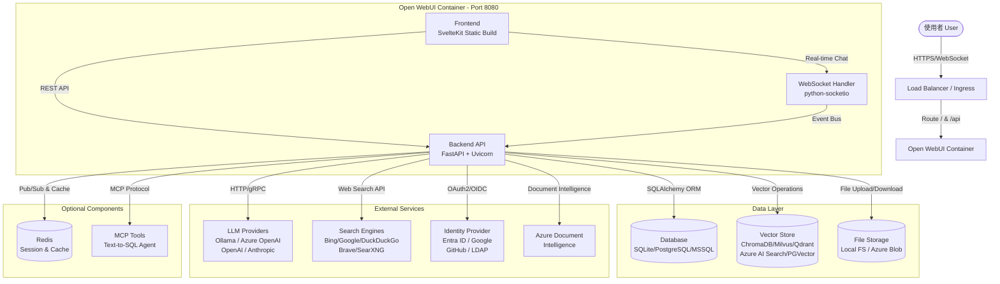
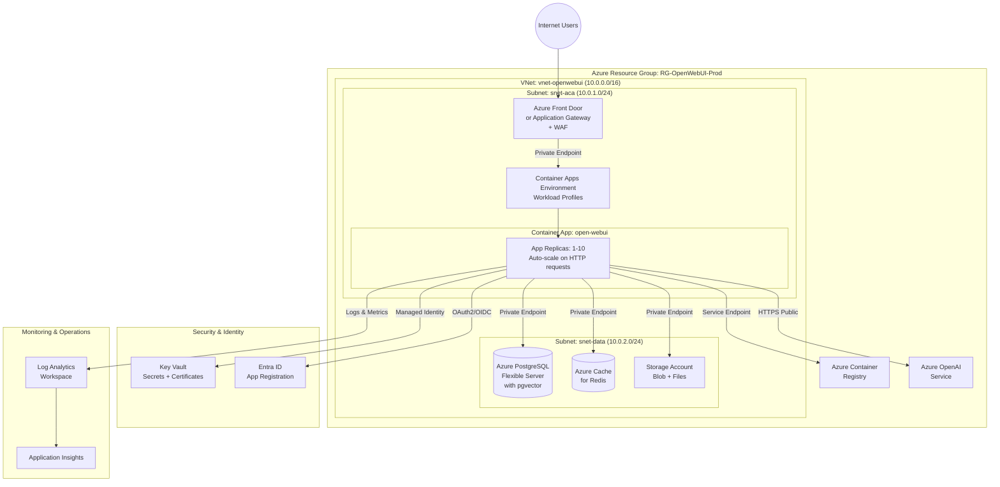
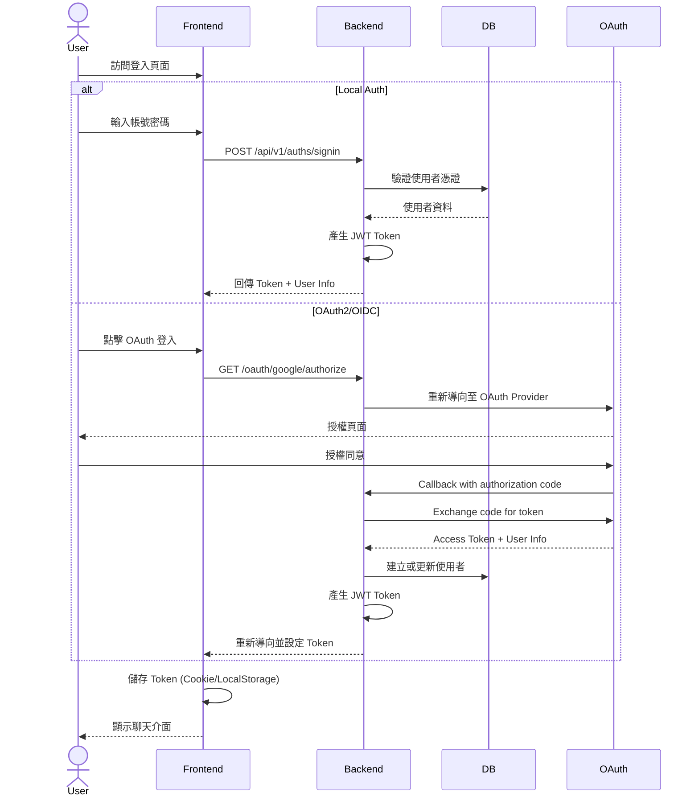
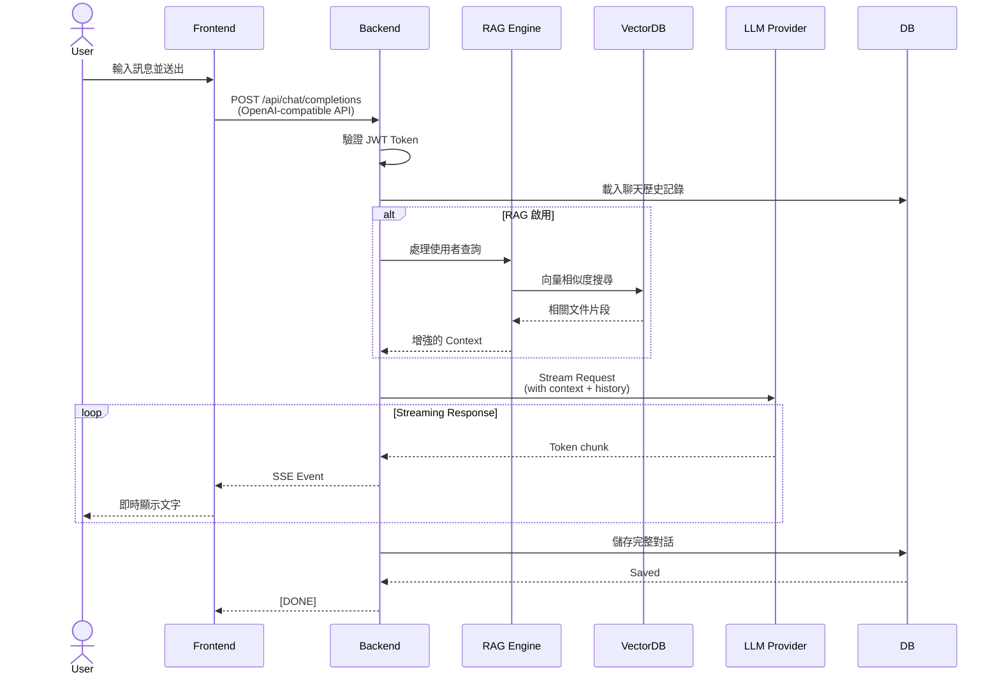
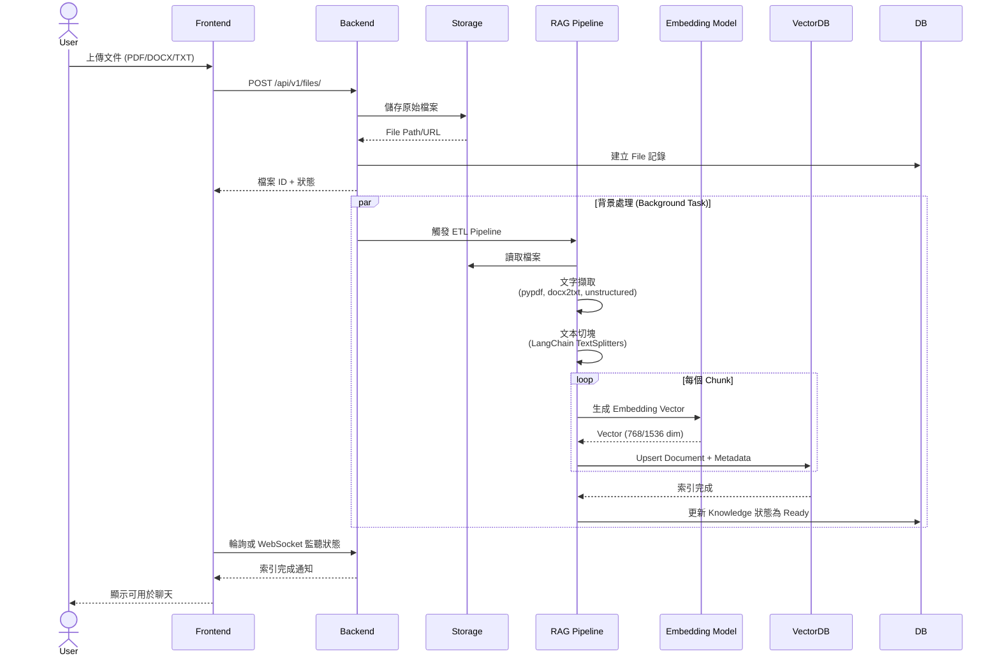

# 系統架構與程式設計文件 (System Architecture & Design)

## 1. 系統架構 (System Architecture)

### 1.1 邏輯架構圖 (Logical Architecture)

本系統基於 **Open WebUI** 架構，為一個 self-hosted AI chat platform，採用前後端分離開發、但整合部署（Backend Serving Frontend）的模式。系統支援多種 LLM providers (Ollama, OpenAI, Azure OpenAI)，並整合 RAG (Retrieval-Augmented Generation) 功能。

### 1.2 Azure 部署架構圖 (Azure Deployment Architecture)

建議採用 **Azure Container Apps (ACA)** 或 **Web App for Containers** 以獲得最佳彈性與維運簡易性。以下以 Azure Container Apps 為例：

**架構特點說明**：
- **網路隔離**: 所有資料服務（PostgreSQL, Redis, Storage）透過 Private Endpoint 連接，不暴露公網
- **自動擴展**: Container Apps 根據 HTTP 請求數量或 CPU/Memory 自動調整 replica 數量（1-10）
- **身份管理**: 使用 Managed Identity 存取 Key Vault 和 Storage，無需管理密碼
- **安全性**: Azure Front Door 提供 WAF 保護，Entra ID 整合企業單一登入
- **可觀測性**: 整合 Application Insights 監控應用程式效能和錯誤

---

## 2. 程式設計說明 (Programming Design)

### 2.1 主要模組說明 (Key Modules)

| 模組 (Module)           | 路徑 (Path)                                          | 說明 (Description)                                                                                                                                                  | 關鍵技術 (Tech Stack)                         |
| :---------------------- | :--------------------------------------------------- | :------------------------------------------------------------------------------------------------------------------------------------------------------------------ | :-------------------------------------------- |
| **Backend Entry**       | `backend/open_webui/main.py`                         | 應用程式入口，設定 FastAPI app、Middleware (CORS, Auth, Audit)、Router 註冊、以及靜態檔案 (Frontend) 的掛載。包含 WebSocket 支援。                                  | FastAPI, Starlette, Uvicorn, python-socketio  |
| **Configuration**       | `backend/open_webui/config.py`                       | 統一管理所有設定 (Env Vars)。包含 DB 連線、LLM Endpoint、Auth 設定等。支援動態載入與 Redis 快取。配置儲存在資料庫中，支援熱更新。                                   | Pydantic, SQLAlchemy, Redis                   |
| **Environment**         | `backend/open_webui/env.py`                          | 環境變數載入與驗證。定義所有可設定的環境變數及其預設值。支援從 .env 檔案或系統環境變數載入。                                                                        | Python dotenv                                 |
| **Database Models**     | `backend/open_webui/models/`                         | 資料模型定義（Users, Chats, Messages, Files, Knowledge 等）。使用 SQLAlchemy ORM，支援 SQLite, PostgreSQL, MSSQL。                                                 | SQLAlchemy, Peewee, Alembic (migrations)      |
| **Retrieval (RAG)**     | `backend/open_webui/retrieval/`                      | 處理文件上傳、切塊 (Chunking)、Embedding 產生與向量搜尋。整合 LangChain 與各種 Vector DB (Chroma, Milvus, Qdrant, Azure AI Search, PGVector, Elasticsearch)。      | LangChain, ChromaDB, Sentence-Transformers    |
| **LLM Routers**         | `backend/open_webui/routers/ollama.py`, `openai.py` | 代理與轉發請求至後端 LLM 引擎。處理 Stream response 轉換。提供 OpenAI-compatible API 介面。                                                                        | Server-Sent Events (SSE), httpx               |
| **Authentication**      | `backend/open_webui/routers/auths.py`                | JWT Token 簽發與驗證、密碼 Hash (Bcrypt/Argon2)、OAuth2 整合（Google, Microsoft, GitHub, OIDC）、LDAP 支援。                                                       | PyJWT, Passlib, Authlib, OAuth2, ldap3        |
| **WebSocket Handler**   | `backend/open_webui/socket/main.py`                  | 處理即時聊天、通知、協作等 WebSocket 連線。支援多使用者即時互動。                                                                                                  | python-socketio, Redis (as message broker)    |
| **Audio Processing**    | `backend/open_webui/routers/audio.py`                | 語音轉文字 (STT) 和文字轉語音 (TTS) 功能。支援 OpenAI Whisper 和其他 TTS 引擎。                                                                                    | faster-whisper, pydub, soundfile              |
| **Image Generation**    | `backend/open_webui/routers/images.py`               | 整合圖像生成服務（OpenAI DALL-E, Automatic1111, ComfyUI）。                                                                                                        | Pillow, opencv, AUTOMATIC1111 API             |
| **Functions & Tools**   | `backend/open_webui/routers/functions.py`            | 自訂 Python 函數工具，支援 Function Calling。使用 RestrictedPython 執行沙箱化的使用者程式碼。                                                                      | RestrictedPython, Docker (optional isolation) |
| **Pipeline Integration** | `backend/open_webui/routers/pipelines.py`            | 整合外部 Pipelines 服務（過濾、監控、轉換等中介層）。                                                                                                              | httpx, async/await                            |
| **MCP Tools**           | `mcp_tools/text_to_sql_agent/`                       | Model Context Protocol (MCP) 工具，提供 Text-to-SQL 功能。可將自然語言查詢轉換為 SQL。                                                                             | FastAPI, SQLAlchemy, LangChain                |
| **Security & Audit**    | `backend/open_webui/utils/audit.py`                  | 審計日誌中介層，記錄所有 API 呼叫和使用者操作。支援不同的審計等級。                                                                                                | Loguru, Middleware                            |

### 2.2 關鍵資料流 (Key Data Flows)

#### 2.2.1 使用者登入流程 (Authentication Flow)

#### 2.2.2 聊天對話流程 (Chat Completion Flow)

#### 2.2.3 文件上傳與 RAG 索引流程 (Document Upload & RAG Indexing)

### 2.3 關鍵外部依賴 (External Dependencies)

#### 2.3.1 必要依賴 (Required Dependencies)

| 依賴項目                       | 用途 (Purpose)                                                   | 建議版本/服務                              | 設定方式                                       |
| :----------------------------- | :--------------------------------------------------------------- | :----------------------------------------- | :--------------------------------------------- |
| **Database**                   | 持久化儲存使用者、聊天、文件等資料                                | PostgreSQL 14+, MSSQL 2019+, SQLite 3.35+ | `DATABASE_URL` 環境變數                        |
| **LLM Provider**               | 語言模型推理服務                                                 | Ollama, Azure OpenAI, OpenAI API           | `OLLAMA_BASE_URLS`, `OPENAI_API_BASE_URLS`    |
| **Embedding Model** (for RAG)  | 文本向量化，用於相似度搜尋                                        | Sentence-Transformers (本地) 或雲端 API    | `RAG_EMBEDDING_MODEL`, `RAG_EMBEDDING_ENGINE`  |
| **Vector Database** (for RAG)  | 儲存與搜尋文件向量                                               | ChromaDB, Milvus, Qdrant, Azure AI Search  | `VECTOR_DB` 環境變數                           |
| **File Storage**               | 儲存上傳的文件與生成的檔案                                        | Local FS, Azure Blob Storage               | `STORAGE_PROVIDER`, `AZURE_BLOB_*`             |

#### 2.3.2 選用依賴 (Optional Dependencies)

| 依賴項目                  | 用途 (Purpose)                          | 建議服務                           | 設定方式                              |
| :------------------------ | :-------------------------------------- | :--------------------------------- | :------------------------------------ |
| **Redis**                 | Session 儲存、快取、WebSocket pub/sub   | Azure Cache for Redis              | `REDIS_URL`, `REDIS_SENTINEL_HOSTS`   |
| **OAuth Provider**        | 企業單一登入 (SSO)                      | Entra ID, Google, GitHub           | `OAUTH_*` 環境變數                    |
| **Web Search API**        | RAG 增強：從網路搜尋即時資訊            | Bing Search, Google PSE, Brave     | `ENABLE_RAG_WEB_SEARCH`, `BING_*`     |
| **Document Intelligence** | 進階 OCR 與文件解析                     | Azure Document Intelligence        | `AZURE_DOC_INTELLIGENCE_*`            |
| **Application Insights**  | APM 監控、日誌分析                      | Azure Application Insights         | `APPLICATIONINSIGHTS_CONNECTION_STRING` |
| **LDAP/Active Directory** | 企業目錄整合                            | Azure AD DS, On-premises AD        | `ENABLE_LDAP`, `LDAP_SERVER_*`        |

#### 2.3.3 開發與測試依賴

- **pytest**: 單元測試與整合測試
- **Docker**: 本地容器化測試環境
- **playwright**: 瀏覽器自動化測試（用於測試網頁爬取功能）
- **black**: Python 程式碼格式化
- **pip-audit**: 依賴套件安全性掃描

### 2.4 設定檔說明 (Configuration Files)

| 檔案                          | 說明                                                                                         |
| :---------------------------- | :------------------------------------------------------------------------------------------- |
| `.env.example`                | 環境變數範本，包含所有可設定的參數                                                            |
| `pyproject.toml`              | Python 專案定義，包含所有依賴套件版本                                                         |
| `Dockerfile`                  | 容器建置腳本，支援 CUDA, CPU, Ollama 等多種建置選項                                           |
| `docker-compose.yaml`         | 本地開發環境設定，包含 Ollama 與 Open WebUI                                                  |
| `azure-pipelines.yml`         | Azure DevOps CI/CD Pipeline 定義，包含建置、掃描、部署到 ACR                                 |
| `azure-pipeline-code-scan.yaml` | 獨立的安全性掃描 Pipeline                                                                     |
| `kubernetes/helm/`            | Helm Chart 用於 Kubernetes 部署                                                              |
| `deploy-aks/*.yaml`           | Azure Kubernetes Service 部署設定（Dev, Staging, Prod 環境）                                 |

### 2.5 資料庫架構概覽 (Database Schema Overview)

主要資料表：

- **users**: 使用者帳號、角色、權限
- **auths**: 認證記錄（OAuth tokens, API keys）
- **chats**: 聊天對話 session
- **messages**: 對話訊息內容
- **files**: 上傳的檔案元資料
- **knowledge**: 知識庫（文件集合）
- **functions**: 自訂函數/工具
- **tools**: 整合的外部工具
- **models**: LLM 模型設定
- **prompts**: 提示詞範本
- **groups**: 使用者群組（RBAC）
- **folders**: 檔案/聊天記錄資料夾組織
- **channels**: 協作頻道
- **feedbacks**: 使用者回饋與評分
- **memories**: 長期記憶（用於個人化）
- **tags**: 標籤系統

所有資料表使用 SQLAlchemy ORM 定義，支援自動 Migration (Alembic)。
